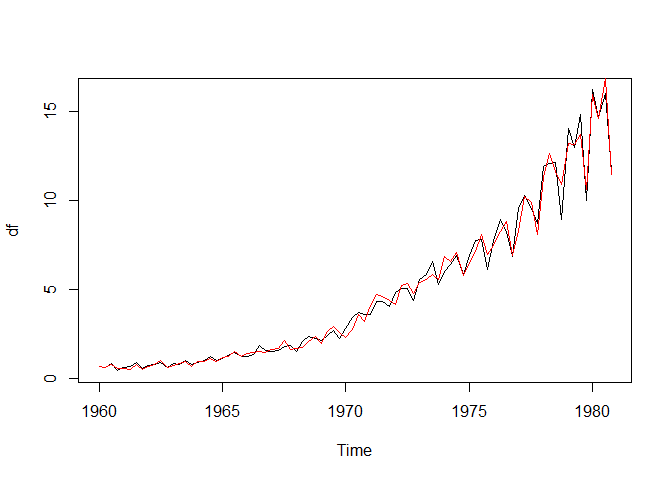
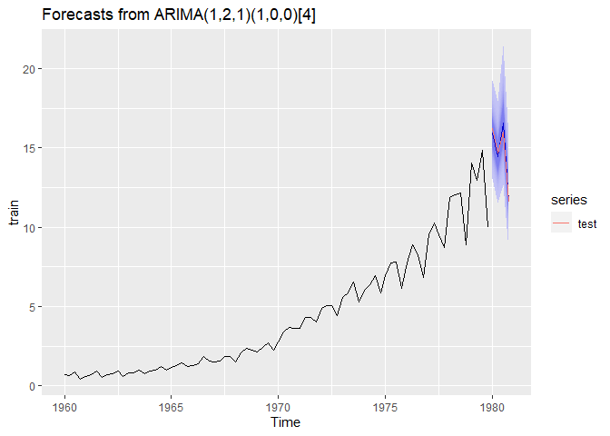

### packages

```r
packages <- c("dplyr", "astsa", "ggfortify", "stats", "fpp2", "tseries", "AICcmodavg", "lmtest", "forecast")

installed_packages <- packages %in% row.names(installed.packages())
if (any(installed_packages == FALSE)) {
  install.packages(packages[!installed.packages])
}

lapply(packages, library, character.only = TRUE)
```

### Import JohnsonJohnson (J&J) quarterly earnings time-series

```r
df <- JohnsonJohnson
df
```

```
##       Qtr1  Qtr2  Qtr3  Qtr4
## 1960  0.71  0.63  0.85  0.44
## 1961  0.61  0.69  0.92  0.55
## 1962  0.72  0.77  0.92  0.60
## 1963  0.83  0.80  1.00  0.77
## 1964  0.92  1.00  1.24  1.00
## 1965  1.16  1.30  1.45  1.25
## 1966  1.26  1.38  1.86  1.56
## 1967  1.53  1.59  1.83  1.86
## 1968  1.53  2.07  2.34  2.25
## 1969  2.16  2.43  2.70  2.25
## 1970  2.79  3.42  3.69  3.60
## 1971  3.60  4.32  4.32  4.05
## 1972  4.86  5.04  5.04  4.41
## 1973  5.58  5.85  6.57  5.31
## 1974  6.03  6.39  6.93  5.85
## 1975  6.93  7.74  7.83  6.12
## 1976  7.74  8.91  8.28  6.84
## 1977  9.54 10.26  9.54  8.73
## 1978 11.88 12.06 12.15  8.91
## 1979 14.04 12.96 14.85  9.99
## 1980 16.20 14.67 16.02 11.61
```
### Plot time series

```r
tsplot(df)
```

<!-- -->

### Lag-plot

```r
lag1.plot(df,4)
```

<!-- -->
### Seasonal plot

```r
ggmonthplot(df)+
  ylab("earnings") +
  ggtitle("Seasonal plot: earnings J&J ")
```

<!-- -->
### Seasonal plot over the years

```r
ggseasonplot(df)
```

<!-- -->
The plots suggest a change in variance over time; an increasing trend; and seasonality.

### Box-Cox transformation to deal with changes in variance

```r
lambda <- BoxCox.lambda(df)
print(lambda)
```

```
## [1] 0.1540752
```

```r
df <- BoxCox(df, lambda = lambda)

plot.ts(df)
```

<!-- -->

## De-trend and de-seasonalize

### 1) Fourier transform

```r
fourier.df <- tslm(df ~ trend + fourier(df, K=2))
summary(fourier.df)
```

```
## 
## Call:
## tslm(formula = df ~ trend + fourier(df, K = 2))
## 
## Residuals:
##      Min       1Q   Median       3Q      Max 
## -0.40811 -0.12175  0.01250  0.08376  0.40962 
## 
## Coefficients:
##                          Estimate Std. Error t value Pr(>|t|)    
## (Intercept)            -0.8133229  0.0327081 -24.866  < 2e-16 ***
## trend                   0.0497141  0.0006686  74.351  < 2e-16 ***
## fourier(df, K = 2)S1-4 -0.0508174  0.0229133  -2.218   0.0294 *  
## fourier(df, K = 2)C1-4 -0.1220909  0.0229133  -5.328 9.11e-07 ***
## fourier(df, K = 2)C2-4 -0.0711908  0.0161987  -4.395 3.41e-05 ***
## ---
## Signif. codes:  0 '***' 0.001 '**' 0.01 '*' 0.05 '.' 0.1 ' ' 1
## 
## Residual standard error: 0.1484 on 79 degrees of freedom
## Multiple R-squared:  0.986,	Adjusted R-squared:  0.9853 
## F-statistic:  1391 on 4 and 79 DF,  p-value: < 2.2e-16
```

```r
autoplot(df, series="Data") +
  autolayer(fitted(fourier.df), series="Fitted") +
  xlab("Year") + ylab("Earnings") +
  ggtitle("earnings J&J")
```

<!-- -->

```r
tsplot(residuals(fourier.df), main = "detrended desasonalized beer data")
```

<!-- -->

```r
seasonplot(residuals(fourier.df))
```

<!-- -->
### linear transform trend & season

```r
fit.df <- tslm(df~ trend + season)
summary(fit.df)
```

```
## 
## Call:
## tslm(formula = df ~ trend + season)
## 
## Residuals:
##      Min       1Q   Median       3Q      Max 
## -0.40811 -0.12175  0.01250  0.08376  0.40962 
## 
## Coefficients:
##               Estimate Std. Error t value Pr(>|t|)    
## (Intercept) -0.7929495  0.0424344 -18.686  < 2e-16 ***
## trend        0.0497141  0.0006686  74.351  < 2e-16 ***
## season2      0.0305267  0.0458119   0.666   0.5071    
## season3      0.1016348  0.0458266   2.218   0.0294 *  
## season4     -0.2136551  0.0458510  -4.660 1.26e-05 ***
## ---
## Signif. codes:  0 '***' 0.001 '**' 0.01 '*' 0.05 '.' 0.1 ' ' 1
## 
## Residual standard error: 0.1484 on 79 degrees of freedom
## Multiple R-squared:  0.986,	Adjusted R-squared:  0.9853 
## F-statistic:  1391 on 4 and 79 DF,  p-value: < 2.2e-16
```
### plot adjusted series & residuals

```r
autoplot(df, series="Data") +
  autolayer(fitted(fit.df), series="Fitted") +
  xlab("Year") + ylab("Megalitres") +
  ggtitle("Quarterly Beer Production")
```

<!-- -->

```r
tsplot(residuals(fit.df), main = "detrended desasonalized beer data")
```

<!-- -->
### Compare AIC of both models

```r
models <- list(fourier.df, fit.df)

#calculate AIC of each model
AIC_fourier <- AIC(fourier.df)
AIC_linear <- AIC(fit.df)
cbind(AIC_fourier, AIC_linear)
```

```
##      AIC_fourier AIC_linear
## [1,]   -75.25508  -75.25508
```
### 3) Loess de-trending

```r
df.stlper=stl(df, s.window="periodic")
df.stl=stl(df, s.window=5)
plot(df.stlper)
```

<!-- -->

```r
plot(df.stl)
```

<!-- -->

### Inspect the remainder correlation 

```r
lag1.plot(df,4)
```

<!-- -->

```r
lag1.plot(df.stl$time.series[,3],4)
```

<!-- -->

### 4) Difference de-trend & de-seasonalize

```r
#tsplot(diff(df))
tsplot(diff(diff(df)))
```

<!-- -->

```r
df <- diff(diff(df), 4)
```


```r
acf1 <- acf(df)
```

<!-- -->

```r
pacf1 <- pacf(df)
```

<!-- -->


```r
lag1.plot(df,4)
```

<!-- -->
Still some correlation remains.

### Dickey-Fuller Test

```r
adf.test(df)
```

```
## Warning in adf.test(df): p-value smaller than printed p-value
```

```
## 
## 	Augmented Dickey-Fuller Test
## 
## data:  df
## Dickey-Fuller = -6.8665, Lag order = 4, p-value = 0.01
## alternative hypothesis: stationary
```
Suggests stationarity (p-value <0.05).


### Compare with the original ts

```r
df_original <- JohnsonJohnson
df_diff <- df

plot.ts(cbind(df_original, df_diff))
```

<!-- -->

---End of the assignment---

### Fit ARIMA model

```r
#I:2 (d)
#AR:1 (p)
#MA:1 (q)
#ARIMA(pdq) = (1,2,1)
df <- JohnsonJohnson

fitSARIMA <- Arima(df, order=c(1,2,1), seasonal = list(order = c(1,0,0), period = 4),method="ML", lambda=lambda)
coeftest(fitSARIMA)
```

```
## 
## z test of coefficients:
## 
##       Estimate Std. Error z value  Pr(>|z|)    
## ar1  -0.484934   0.096543  -5.023 5.088e-07 ***
## ma1  -0.999992   0.021120 -47.348 < 2.2e-16 ***
## sar1  0.908957   0.049301  18.437 < 2.2e-16 ***
## ---
## Signif. codes:  0 '***' 0.001 '**' 0.01 '*' 0.05 '.' 0.1 ' ' 1
```

```r
fitARIMA <- Arima(df, order=c(1,2,1), method="ML",lambda=lambda)
coeftest(fitARIMA)
```

```
## 
## z test of coefficients:
## 
##      Estimate Std. Error z value  Pr(>|z|)    
## ar1 -0.515439   0.096960  -5.316 1.061e-07 ***
## ma1 -1.000000   0.033494 -29.856 < 2.2e-16 ***
## ---
## Signif. codes:  0 '***' 0.001 '**' 0.01 '*' 0.05 '.' 0.1 ' ' 1
```

```r
AIC_SARIMA <- AIC(fitSARIMA)
AIC_ARIMA <- AIC(fitARIMA)
cbind(AIC_ARIMA, AIC_SARIMA)
```

```
##      AIC_ARIMA AIC_SARIMA
## [1,] -8.820385  -112.9961
```
### check residuals

```r
tsdisplay(fitSARIMA$residuals)
```

<!-- -->

```r
qqnorm(fitSARIMA$residuals); qqline(fitSARIMA$residuals) 
```

<!-- -->
### Plot SARIMA vs df

```r
plot(df)
lines(fitted(fitSARIMA), col="red")
```

<!-- -->
### Ljung Box-test

```r
Box.test(resid(fitSARIMA),type="Ljung",lag=20,fitdf=1)
```

```
## 
## 	Box-Ljung test
## 
## data:  resid(fitSARIMA)
## X-squared = 24.793, df = 19, p-value = 0.1675
```

### Forecast

```r
Forecastmodel = forecast(fitSARIMA, h = 10, lambda = lambda, level = c(95)) 
```

```
## Warning in InvBoxCox(pred$pred, lambda, biasadj, pred$se^2): biasadj information
## not found, defaulting to FALSE.
```

```r
plot(Forecastmodel)
```

<!-- -->
### train-test split

```r
train <- head(df, round(length(df) * 0.95))
h <- length(df) - length(train)
test <- tail(df, h)
autoplot(train) + autolayer(test)
```

<!-- -->

### Fit Sarima train-set for predicting next year earnings (4 quarters)

```r
fitSARIMA <- Arima(train, order=c(1,2,1), seasonal = list(order = c(1,0,0), period = 4),method="ML", lambda=lambda)
```

### Forecast

```r
#Forecastmodel = forecast(train, h = 4, lambda = lambda, level = c(95)) 

fitSARIMA %>%
  forecast(train, h = 4, lambda = lambda, level = c(95)) %>%
  autoplot() + autolayer(test)
```

```
## Warning in if (fan) {: the condition has length > 1 and only the first element
## will be used
```

```
## Warning in InvBoxCox(pred$pred, lambda, biasadj, pred$se^2): biasadj information
## not found, defaulting to FALSE.
```

<!-- -->
### Metrics

```r
arima.test <- Arima(test, model=fitSARIMA)
accuracy(arima.test)
```

```
##                      ME      RMSE       MAE       MPE     MAPE MASE      ACF1
## Training set -0.1330484 0.6121608 0.4302757 -1.476809 3.331591  NaN -0.419647
```
